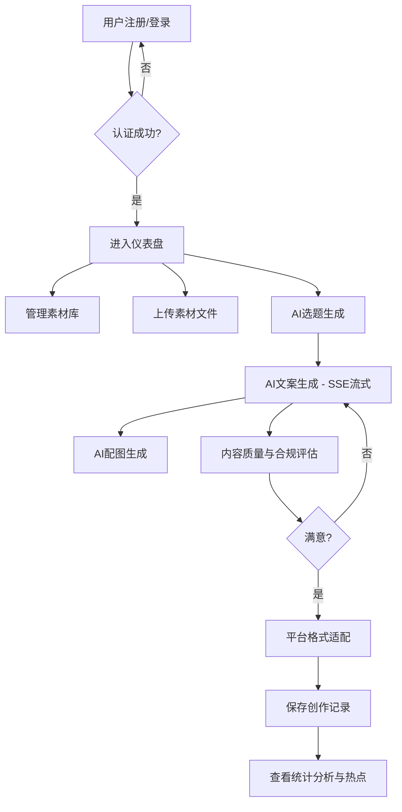
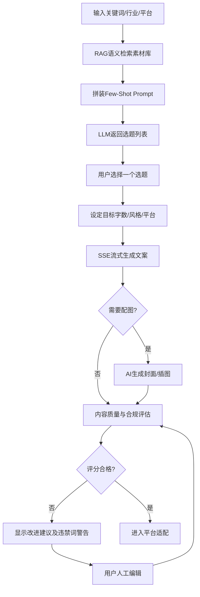
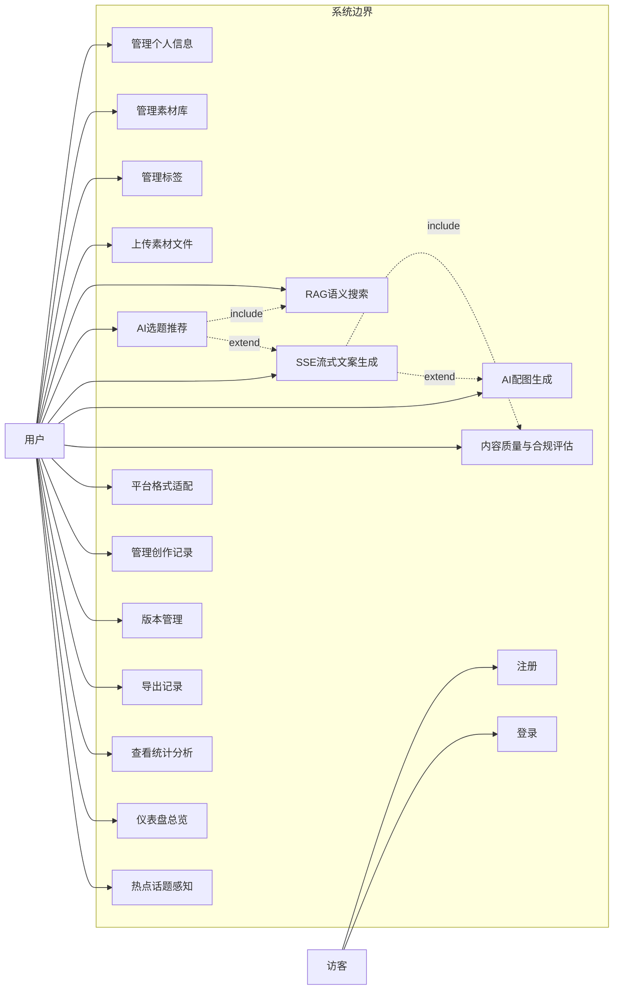
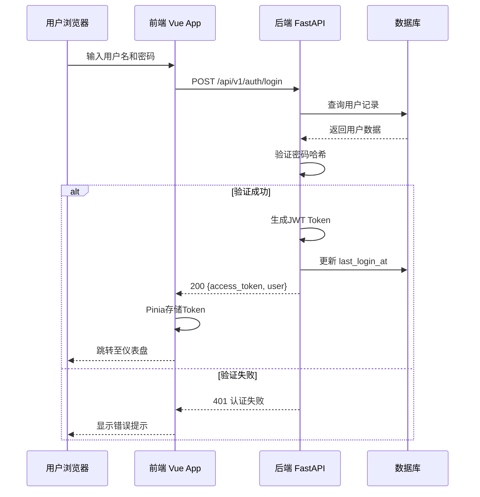
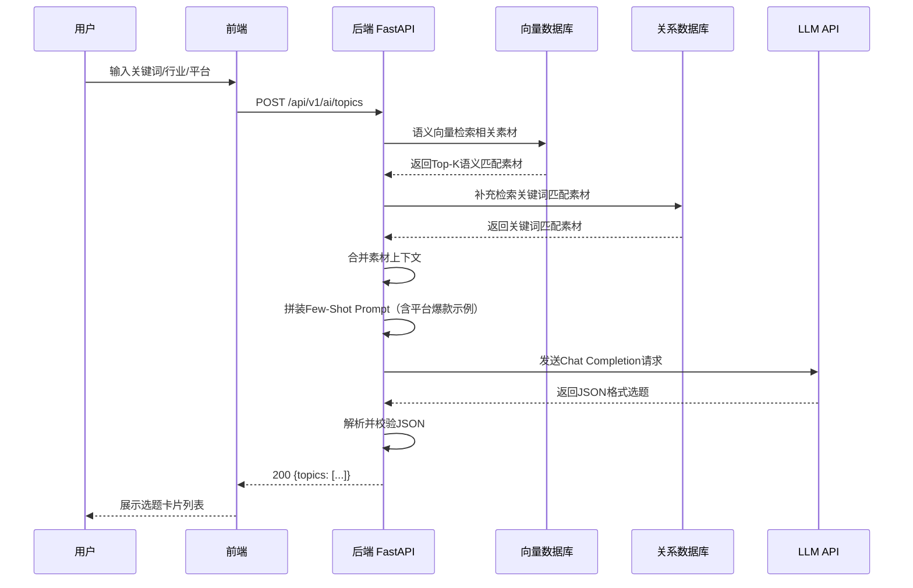
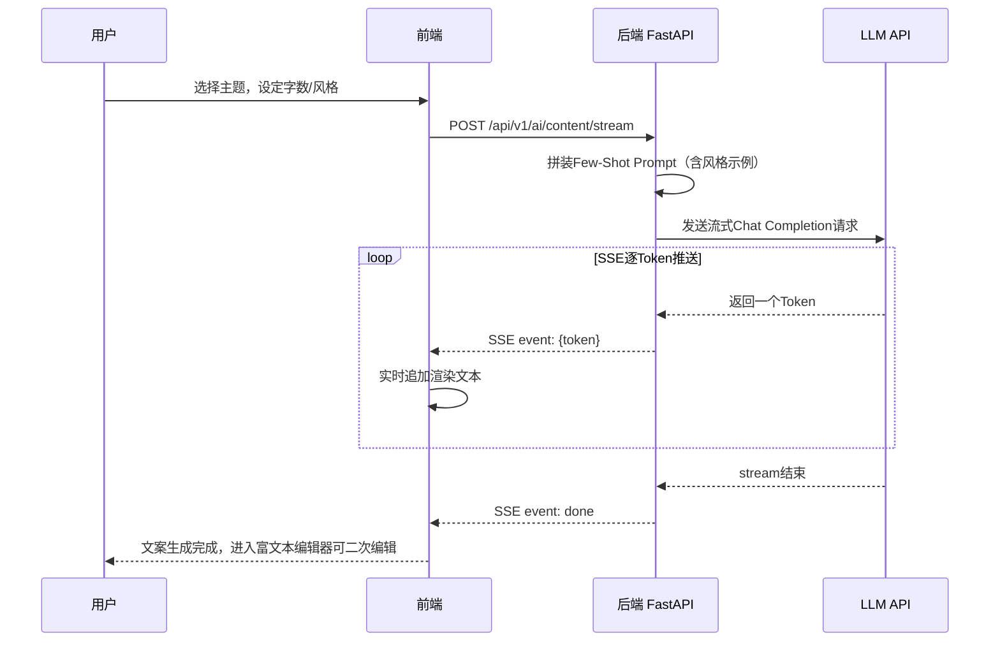
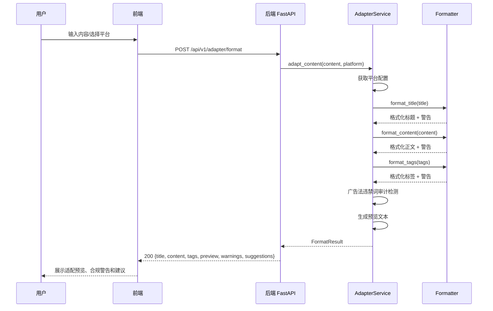
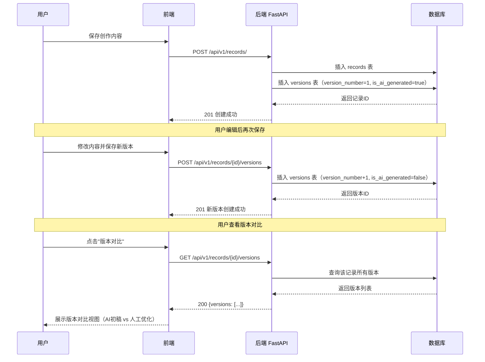
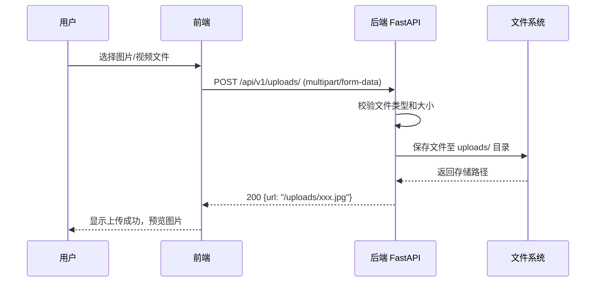
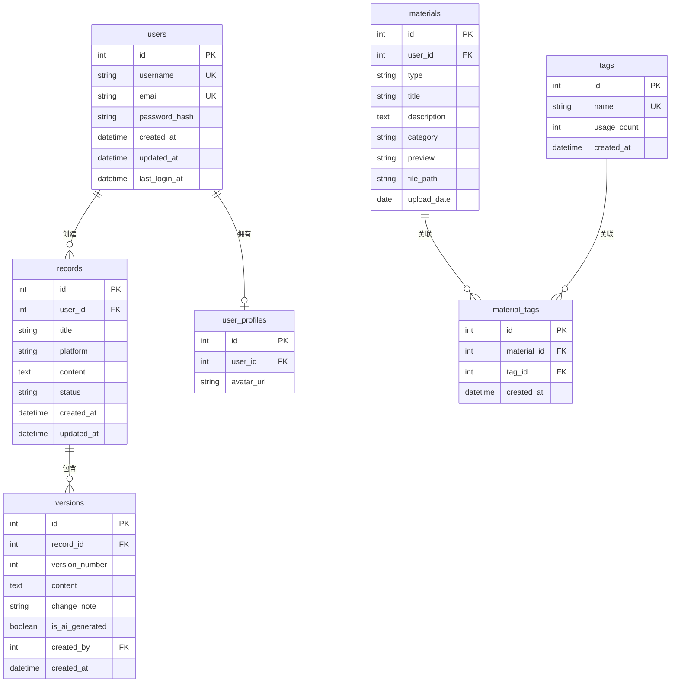

# 面向流媒体/自媒体营销的"内容创作AI-Agent"  需求规格说明书

## 目录

1. [引言](#1-引言)
2. [用户需求说明](#2-用户需求说明)
3. [需求分析建模](#3-需求分析建模)
4. [非功能性需求说明](#4-非功能性需求说明)

---

## 1. 引言

### 1.1 编写目的

本文档是"面向流媒体/自媒体营销的内容创作AI-Agent"项目的需求规格说明书，对系统的功能性需求与非功能性需求进行了完整、详细的描述和建模。文档面向开发团队成员、课程指导教师以及项目评审人员，作为后续系统设计、编码实现和验收测试的依据。

### 1.2 项目概述

本系统面向自媒体从业者，提供一款轻量化的AI辅助内容创作工具，核心功能包括：基于RAG语义检索的营销素材库管理、AI智能选题推荐与文案生成（支持SSE流式输出与Few-Shot提示词工程）、多模态内容创作（文案+AI配图）、多平台格式适配（抖音/小红书/微信视频号，内置合规审计）、创作记录版本化管理，以及创作数据的统计分析可视化。

### 1.3 术语与定义

| 术语 | 定义 |
| :--- | :--- |
| LLM | Large Language Model，大语言模型 |
| JWT | JSON Web Token，一种用于身份认证的紧凑令牌标准 |
| ORM | Object-Relational Mapping，对象关系映射 |
| CRUD | Create, Read, Update, Delete，数据的增删改查操作 |
| SSE | Server-Sent Events，服务端主动推送技术，用于实现流式文案生成 |
| RAG | Retrieval-Augmented Generation，检索增强生成，结合向量数据库提升AI生成质量 |
| Prompt | 提示词，用于引导 LLM 生成内容的指令文本 |
| Few-Shot | 少样本学习，通过在Prompt中嵌入少量示例引导模型输出特定风格 |
| 向量数据库 | 存储文本向量化表示的数据库（如ChromaDB），用于语义相似度检索 |

---

## 2. 用户需求说明

### 2.1 系统角色定义

本系统涉及以下用户角色：

| 角色 | 描述 |
| :--- | :--- |
| **访客** | 未注册/未登录用户，仅可访问登录和注册页面 |
| **普通用户** | 已注册并登录的自媒体创作者，可使用系统全部核心功能 |
| **管理员** | 系统内置的管理账号（admin），具有完整的数据管理权限 |

### 2.2 功能模块总览

系统包含以下六大功能模块：

| 模块编号 | 模块名称 | 简要说明 |
| :---: | :--- | :--- |
| M1 | 用户认证模块 | 注册、登录、修改密码、个人信息管理 |
| M2 | 素材库管理模块 | 素材增删改查、分类标签管理、RAG语义检索、文件上传 |
| M3 | AI内容生成模块 | 选题推荐（Few-Shot）、流式文案生成（SSE）、多模态AI配图、内容质量与合规评估 |
| M4 | 平台适配模块 | 抖音/小红书/微信视频号格式自动转换、广告法合规审计 |
| M5 | 创作记录模块 | 创作历史记录、版本管理、检索导出（Word/PDF） |
| M6 | 统计分析与仪表盘模块 | 产出统计、关键词分析、热点感知、数据可视化看板 |

### 2.3 业务流程

#### 2.3.1 总体业务流程



#### 2.3.2 AI内容创作业务流程



### 2.4 用户故事 (User Stories)

#### M1 用户认证模块

| 编号 | 用户故事 | 验收条件 |
| :--- | :--- | :--- |
| US-1.1 | 作为访客，我希望能注册新账号，以便使用系统功能 | 1. 提供用户名、邮箱、密码；2. 用户名和邮箱唯一性校验；3. 密码哈希存储 |
| US-1.2 | 作为访客，我希望通过用户名和密码登录系统 | 1. 验证凭证正确后返回JWT Token；2. 记录最后登录时间 |
| US-1.3 | 作为用户，我希望能修改个人密码 | 1. 验证旧密码正确；2. 新密码哈希更新 |
| US-1.4 | 作为用户，我希望能管理个人信息和头像 | 1. 支持上传/更换头像；2. 查看个人资料 |

#### M2 素材库管理模块

| 编号 | 用户故事 | 验收条件 |
| :--- | :--- | :--- |
| US-2.1 | 作为用户，我希望能新增素材到素材库 | 1. 填写标题、描述、分类、预览；2. 支持类型: template/image/video |
| US-2.2 | 作为用户，我希望能按关键词搜索素材 | 1. 支持标题模糊搜索；2. 支持按分类筛选 |
| US-2.3 | 作为用户，我希望能管理素材的标签 | 1. 创建新标签；2. 为素材关联/移除标签；3. 统计标签使用次数 |
| US-2.4 | 作为用户，我希望能编辑和删除已有素材 | 1. 支持修改所有字段；2. 删除时级联清理关联标签 |
| US-2.5 | 作为用户，我希望能上传图片/视频素材文件 | 1. 支持常见图片格式（jpg/png/gif）；2. 文件存储至服务器uploads目录；3. 返回可访问的URL |
| US-2.6 | 作为用户，我希望通过语义相似度搜索素材 | 1. 基于RAG将素材文本向量化；2. 搜索"养生"能关联到"健康饮食"等语义相近素材 |

#### M3 AI内容生成模块

| 编号 | 用户故事 | 验收条件 |
| :--- | :--- | :--- |
| US-3.1 | 作为用户，我希望输入关键词后获得智能选题推荐 | 1. 输入关键词、行业、平台；2. 生成5个选题（标题+描述）；3. 结合素材库内容（RAG语义匹配）生成；4. 使用Few-Shot模板注入平台风格示例 |
| US-3.2 | 作为用户，我希望根据选定主题实时流式生成文案 | 1. 输入主题、字数、风格、平台；2. 通过SSE协议逐字流式返回；3. 前端实时渲染生成过程；4. 支持富文本编辑器二次修改 |
| US-3.3 | 作为用户，我希望系统能评估生成内容的质量与合规性 | 1. 检查字数是否达标；2. 检查关键词覆盖率；3. 检测广告法违禁词（如"最""第一""100%"等）；4. 给出合规风险提示与改进建议 |
| US-3.4 | 作为用户，我希望能为文案一键生成配图 | 1. 根据文案主题调用图像生成API；2. 生成适合平台尺寸的封面图或插图；3. 支持预览和下载 |

#### M4 平台适配模块

| 编号 | 用户故事 | 验收条件 |
| :--- | :--- | :--- |
| US-4.1 | 作为用户，我希望将文案一键适配为抖音格式 | 1. 自动调整标题长度（≤20字）；2. 格式化标签为#话题#；3. 适配短视频脚本结构（画面+口播） |
| US-4.2 | 作为用户，我希望将文案一键适配为小红书格式 | 1. 自动添加Emoji装饰；2. 格式化为小红书笔记风格；3. 自动提取话题Tag |
| US-4.3 | 作为用户，我希望将文案一键适配为微信视频号格式 | 1. 生成标题+描述；2. 按视频号规范排版 |
| US-4.4 | 作为用户，我希望在适配后能实时预览效果 | 1. 展示适配后的完整预览；2. 显示格式警告和建议 |
| US-4.5 | 作为用户，我希望适配过程自动检测违规风险 | 1. 内置广告法禁用词库；2. 适配结果中标注风险词及替换建议 |

#### M5 创作记录模块

| 编号 | 用户故事 | 验收条件 |
| :--- | :--- | :--- |
| US-5.1 | 作为用户，我希望每次创作都自动保存记录 | 1. 记录标题、平台、内容、状态；2. 自动记录创建时间 |
| US-5.2 | 作为用户，我希望管理创作记录的版本 | 1. 每次修改生成新版本；2. 标记AI生成/人工编辑；3. 支持版本对比 |
| US-5.3 | 作为用户，我希望能按条件检索历史记录 | 1. 按时间范围筛选；2. 按平台筛选；3. 按关键词搜索 |
| US-5.4 | 作为用户，我希望能导出创作记录 | 1. 支持导出为Word文档；2. 支持导出为PDF文件 |

#### M6 统计分析与仪表盘模块

| 编号 | 用户故事 | 验收条件 |
| :--- | :--- | :--- |
| US-6.1 | 作为用户，我希望查看每日创作产出统计 | 1. 折线图展示每日产出趋势；2. 支持按天/周/月切换时间范围 |
| US-6.2 | 作为用户，我希望查看关键词使用频次 | 1. 词云图展示热门关键词；2. 表格展示使用排名 |
| US-6.3 | 作为用户，我希望在仪表盘总览核心数据 | 1. 显示总创作数、本月创作数、素材总量；2. 平台分布饼图；3. 近期创作列表；4. 创作趋势折线图 |
| US-6.4 | 作为用户，我希望获取当前热门话题推荐 | 1. 对接热搜/热榜API获取实时热点；2. 在仪表盘/选题页面展示热门话题卡片 |

---

## 3. 需求分析建模

### 3.1 用例图

#### 3.1.1 系统总体用例图



### 3.2 时序图

#### 3.2.1 用户登录时序图



#### 3.2.2 AI选题生成时序图（含RAG + Few-Shot）



#### 3.2.3 SSE流式文案生成时序图



#### 3.2.4 平台适配时序图



#### 3.2.5 创作记录与版本管理时序图



#### 3.2.6 文件上传时序图



### 3.3 数据概念设计（ER图）



### 3.4 数据字典

#### 3.4.1 users（用户表）

| 字段名 | 数据类型 | 约束 | 说明 |
| :--- | :--- | :--- | :--- |
| id | INTEGER | PK, AUTO_INCREMENT | 用户唯一标识 |
| username | VARCHAR(50) | NOT NULL, UNIQUE, INDEX | 用户名，用于登录 |
| email | VARCHAR(100) | NOT NULL, UNIQUE, INDEX | 邮箱地址 |
| password_hash | VARCHAR(255) | NOT NULL | bcrypt加密后的密码哈希 |
| created_at | DATETIME | DEFAULT CURRENT_TIMESTAMP | 注册时间 |
| updated_at | DATETIME | DEFAULT CURRENT_TIMESTAMP, ON UPDATE | 最后更新时间 |
| last_login_at | DATETIME | NULLABLE | 最后登录时间 |

#### 3.4.2 user_profiles（用户资料表）

| 字段名 | 数据类型 | 约束 | 说明 |
| :--- | :--- | :--- | :--- |
| id | INTEGER | PK, AUTO_INCREMENT | 主键 |
| user_id | INTEGER | FK → users.id, UNIQUE, ON DELETE CASCADE | 关联的用户ID |
| avatar_url | VARCHAR(255) | NULLABLE | 用户头像URL |

#### 3.4.3 materials（素材表）

| 字段名 | 数据类型 | 约束 | 说明 |
| :--- | :--- | :--- | :--- |
| id | INTEGER | PK, AUTO_INCREMENT | 素材唯一标识 |
| user_id | INTEGER | NULLABLE, INDEX | 创建者ID |
| type | VARCHAR(20) | NOT NULL, DEFAULT 'template' | 素材类型：template/image/video |
| title | VARCHAR(255) | NOT NULL | 素材标题 |
| description | TEXT | NOT NULL | 素材详细内容/描述 |
| category | VARCHAR(50) | NOT NULL, DEFAULT 'default' | 分类标签 |
| preview | VARCHAR(1000) | NOT NULL, DEFAULT '' | 预览摘要文本 |
| file_path | VARCHAR(500) | NULLABLE | 文件存储路径（图片/视频） |
| upload_date | DATE | NULLABLE | 上传日期 |

#### 3.4.4 tags（标签表）

| 字段名 | 数据类型 | 约束 | 说明 |
| :--- | :--- | :--- | :--- |
| id | INTEGER | PK, AUTO_INCREMENT | 标签唯一标识 |
| name | VARCHAR(50) | NOT NULL, UNIQUE, INDEX | 标签名称 |
| usage_count | INTEGER | NOT NULL, DEFAULT 0 | 使用次数计数 |
| created_at | DATETIME | DEFAULT CURRENT_TIMESTAMP | 创建时间 |

#### 3.4.5 material_tags（素材-标签关联表）

| 字段名 | 数据类型 | 约束 | 说明 |
| :--- | :--- | :--- | :--- |
| id | INTEGER | PK, AUTO_INCREMENT | 主键 |
| material_id | INTEGER | FK → materials.id, NOT NULL, INDEX, ON DELETE CASCADE | 素材ID |
| tag_id | INTEGER | FK → tags.id, NOT NULL, INDEX, ON DELETE CASCADE | 标签ID |
| created_at | DATETIME | DEFAULT CURRENT_TIMESTAMP | 关联创建时间 |

> **唯一约束**：`UNIQUE(material_id, tag_id)`，防止重复关联。

#### 3.4.6 records（创作记录表）

| 字段名 | 数据类型 | 约束 | 说明 |
| :--- | :--- | :--- | :--- |
| id | INTEGER | PK, AUTO_INCREMENT | 记录唯一标识 |
| user_id | INTEGER | FK → users.id, NOT NULL, INDEX, ON DELETE CASCADE | 创建者ID |
| title | VARCHAR(200) | NOT NULL, INDEX | 创作标题 |
| platform | VARCHAR(50) | NOT NULL, INDEX | 目标平台：douyin/xiaohongshu/wechat/bilibili |
| content | TEXT | NULLABLE | 创作内容正文 |
| status | VARCHAR(20) | NOT NULL, DEFAULT 'draft', INDEX | 状态：draft/published/archived |
| created_at | DATETIME | DEFAULT CURRENT_TIMESTAMP, INDEX | 创建时间 |
| updated_at | DATETIME | DEFAULT CURRENT_TIMESTAMP, ON UPDATE | 最后修改时间 |

#### 3.4.7 versions（版本表）

| 字段名 | 数据类型 | 约束 | 说明 |
| :--- | :--- | :--- | :--- |
| id | INTEGER | PK, AUTO_INCREMENT | 版本唯一标识 |
| record_id | INTEGER | FK → records.id, NOT NULL, INDEX, ON DELETE CASCADE | 所属创作记录ID |
| version_number | INTEGER | NOT NULL, DEFAULT 1 | 版本序号（1, 2, 3...） |
| content | TEXT | NOT NULL | 该版本的完整内容快照 |
| change_note | VARCHAR(500) | NULLABLE | 版本修改说明 |
| is_ai_generated | BOOLEAN | NOT NULL, DEFAULT TRUE | 是否为AI初始生成（true=AI生成，false=人工编辑） |
| created_by | INTEGER | FK → users.id, NULLABLE, INDEX, ON DELETE SET NULL | 创建该版本的用户ID |
| created_at | DATETIME | DEFAULT CURRENT_TIMESTAMP | 版本创建时间 |

---

## 4. 非功能性需求说明

### 4.1 开发环境

| 项目 | 规格要求 |
| :--- | :--- |
| **操作系统** | Windows 10/11, macOS, Linux (Ubuntu 22.04+) |
| **IDE/编辑器** | VS Code（推荐），HBuilderX, PyCharm |
| **Node.js** | v18.0+ |
| **Python** | v3.10+ |
| **包管理** | npm (前端), pip + venv (后端) |
| **版本控制** | Git 2.40+, GitHub |
| **API调试** | Postman, Swagger UI (http://localhost:8000/docs) |
| **数据库管理** | MySQL Workbench |

### 4.2 运行环境

| 项目 | 规格要求 |
| :--- | :--- |
| **前端服务器** | Vite Dev Server (开发), Nginx (生产) |
| **后端服务器** | Uvicorn (FastAPI内置ASGI服务器) |
| **数据库** | MySQL 8.0+ |
| **向量数据库** | ChromaDB（RAG语义检索） |
| **缓存** | Redis 6.0+ (可选，用于高速缓存) |
| **容器化** | Docker 20.10+, Docker Compose v2 |
| **反向代理** | Nginx 1.24+ |
| **最低浏览器** | Chrome 90+, Firefox 88+, Edge 90+, Safari 15+ |

### 4.3 系统依赖项

#### 4.3.1 后端核心依赖

| 依赖包 | 版本 | 用途 |
| :--- | :--- | :--- |
| fastapi | 0.129.0 | Web框架（支持SSE流式响应） |
| uvicorn | 0.41.0 | ASGI服务器 |
| sqlalchemy | 2.0.46 | ORM框架 |
| alembic | 1.18.4 | 数据库迁移工具 |
| pydantic | 2.12.5 | 数据校验与序列化 |
| pydantic-settings | 2.13.1 | 配置文件管理 |
| python-jose | 3.3.0 | JWT Token生成/验证 |
| passlib + bcrypt | 1.7.4 / 4.3.0 | 密码哈希加密 |
| openai | 2.21.0 | OpenAI/ChatAnywhere API客户端（支持流式） |
| python-dotenv | 1.2.1 | 环境变量管理（API Key脱敏） |
| python-multipart | 0.0.22 | 文件上传支持 |
| redis | 7.2.0 | Redis客户端 |
| PyMySQL | 1.1.0 | MySQL数据库驱动 |
| email-validator | 2.3.0 | 邮箱格式校验 |
| python-docx | 1.1.0 | Word文档导出 |
| reportlab | 4.0.7 | PDF文档导出 |

#### 4.3.2 前端核心依赖

| 依赖包 | 版本 | 用途 |
| :--- | :--- | :--- |
| vue | ^3.3.0 | 前端核心框架 |
| vue-router | ^4.2.0 | 前端路由管理 |
| pinia | ^2.1.0 | 全局状态管理 |
| element-plus | ^2.3.0 | UI组件库 |
| @element-plus/icons-vue | ^2.1.0 | Element Plus图标库 |
| axios | ^1.4.0 | HTTP请求客户端 |
| echarts | ^5.4.0 | 数据可视化图表 |
| @vueup/vue-quill | ^1.2.0 | 富文本编辑器 |
| dayjs | ^1.11.0 | 日期处理工具 |
| vite | ^4.3.0 | 前端构建工具 |
| sass | ^1.97.3 | CSS预处理器 |

### 4.4 性能需求

| 指标 | 要求 |
| :--- | :--- |
| 核心功能响应时间 | ≤ 2 秒（不含AI生成等待） |
| AI内容生成响应时间 | 首Token ≤ 3 秒（SSE流式），完整文案 ≤ 15 秒 |
| 并发用户数 | ≥ 10 个用户同时在线 |
| 每日处理记录数 | ≥ 1000 条 |
| 页面首屏加载时间 | ≤ 3 秒 |
| 文件上传限制 | 单文件 ≤ 10MB |

### 4.5 安全需求

| 安全项 | 实现方式 |
| :--- | :--- |
| 用户密码 | bcrypt哈希加密存储，不可逆 |
| 身份认证 | JWT Token机制，有效期30分钟 |
| API权限 | 路由守卫 + 后端依赖注入鉴权 |
| SQL注入防护 | SQLAlchemy ORM参数化查询 |
| XSS防护 | 前端输出转义 + CSP策略 |
| CORS策略 | 白名单式跨域配置 |
| 敏感信息脱敏 | API Key等配置通过.env文件管理，不入代码库 |
| 内容合规审计 | 内置广告法违禁词库，AI输出经合规检查后再返回前端 |

### 4.6 接口规范

- **协议**：RESTful API over HTTP/HTTPS
- **数据格式**：JSON（常规接口）/ SSE text/event-stream（流式接口）
- **API版本**：`/api/v1/`
- **认证方式**：`Authorization: Bearer <JWT Token>`
- **统一响应结构**：

```json
{
  "code": 200,
  "message": "操作成功",
  "data": { ... }
}
```

- **SSE流式响应结构**：

```
event: message
data: {"token": "你"}

event: message
data: {"token": "好"}

event: done
data: {}
```

- **错误响应结构**：

```json
{
  "code": 422,
  "message": "请求参数验证失败",
  "errors": [ ... ]
}
```

