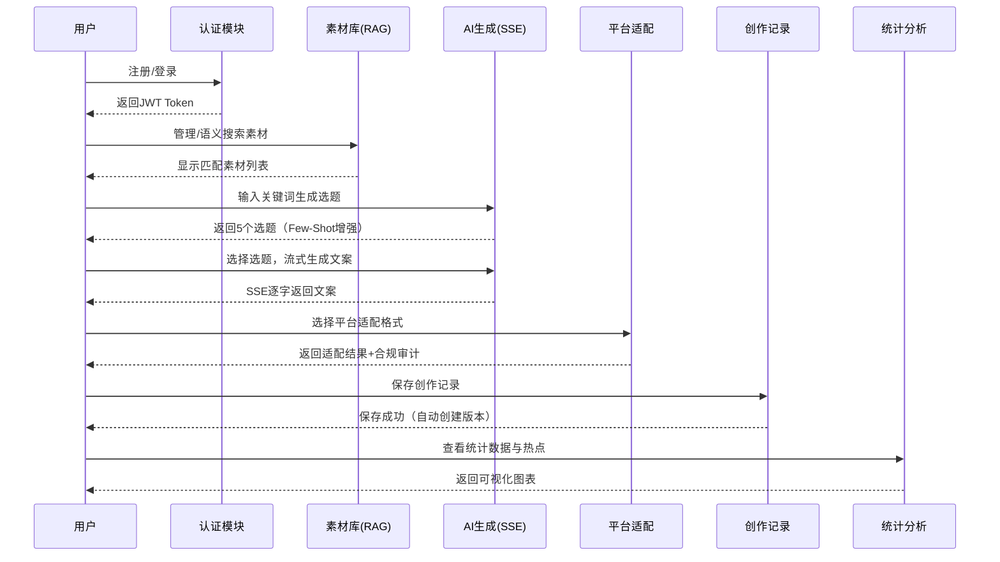

# 面向流媒体/自媒体营销的"内容创作AI-Agent"项目定位与功能设计

---

**文档版本**：2.0  
**编制日期**：2026年3月  
**编制人**：项目团队（4人）  
**审核人**：团队负责人

---

## 1. 项目定位

### 1.1 产品定位

**核心定位**：轻量化、易上手的流媒体/自媒体营销内容辅助工具

**目标用户**：
- 自媒体从业者（抖音、小红书、微信视频号等平台创作者）
- 营销人员
- 内容运营人员
- 初创团队

**产品特点**：
- **轻量化**：基于Web应用，无需安装，即开即用
- **易上手**：界面简洁，操作流程以"一键"为核心设计理念
- **智能化**：AI辅助内容生成（RAG语义检索 + Few-Shot提示词工程 + SSE流式输出）
- **多模态**：支持文案+AI配图一站式生成
- **多平台适配**：一键适配抖音/小红书/微信视频号，内置合规审计
- **数据驱动**：统计分析与热点感知功能，帮助优化创作策略

### 1.2 市场定位

**市场细分**：自媒体内容创作工具市场

**竞争优势**：
- 聚焦营销场景，针对性更强
- 多平台一站式适配，节省时间
- AI辅助创作（RAG增强 + 流式体验），降低创作门槛
- 轻量化设计，易于部署和使用

**差异化定位**：
- 不同于复杂的CMS系统，专注于内容创作核心环节
- 不同于纯AI写作工具，提供完整的内容管理与合规审计流程
- 不同于单一平台工具，支持多平台内容适配

### 1.3 技术定位

**技术架构**：前后端分离架构

**技术特点**：
- 前端：Vue.js 3 + Element Plus，现代化UI框架
- 后端：Python FastAPI，高性能异步框架（支持SSE流式响应）
- 数据库：MySQL + Redis + ChromaDB（向量数据库）
- AI服务：支持多种大模型API（OpenAI/通义千问/文心一言）
- 部署：Docker容器化，易于部署和扩展

**开发定位**：
- 14周课程周期，按课程阶段有序推进
- 4人团队，模块化开发
- Scrum敏捷迭代

## 2. 核心功能设计

### 2.1 功能架构图

```mermaid
graph TB
    A[内容创作AI-Agent] --> B[用户认证模块]
    A --> C[素材库管理模块]
    A --> D[AI内容生成模块]
    A --> E[平台适配模块]
    A --> F[创作记录模块]
    A --> G[统计分析与仪表盘模块]

    B --> B1[用户注册/登录]
    B --> B2[JWT认证]
    B --> B3[个人信息与头像管理]

    C --> C1[素材CRUD]
    C --> C2[分类与标签管理]
    C --> C3[文件上传]
    C --> C4[RAG语义检索]

    D --> D1[Few-Shot选题推荐]
    D --> D2[SSE流式文案生成]
    D --> D3[AI配图生成]
    D --> D4[质量与合规评估]
    D --> D5[人工编辑]

    E --> E1[抖音适配]
    E --> E2[小红书适配]
    E --> E3[微信视频号适配]
    E --> E4[违禁词合规审计]

    F --> F1[创作历史]
    F --> F2[版本管理]
    F --> F3[检索功能]
    F --> F4[导出功能]

    G --> G1[每日统计]
    G --> G2[关键词分析]
    G --> G3[数据可视化]
    G --> G4[热点话题感知]
```

### 2.2 功能详细设计

#### 2.2.1 用户认证模块

**功能描述**：提供用户注册、登录、认证功能

**核心功能**：
1. **用户注册**：用户名/邮箱注册，唯一性校验，密码bcrypt加密
2. **用户登录**：用户名密码登录，JWT Token生成，记录最后登录时间
3. **JWT认证**：Token生成/验证/刷新，路由守卫权限控制
4. **用户信息管理**：修改密码、更新个人信息、头像上传

**技术实现**：FastAPI + JWT + bcrypt，Vue Router + Pinia + Axios

#### 2.2.2 素材库管理模块

**功能描述**：管理营销素材，支持语义智能检索

**核心功能**：
1. **素材管理**：素材创建（template/image/video）、编辑、删除、预览
2. **分类与标签管理**：分类创建/编辑，标签创建/关联/搜索，热门标签推荐
3. **文件上传**：支持图片/视频文件上传至服务器uploads目录
4. **RAG语义检索**：基于向量数据库的语义相似度搜索，关键词搜索，分类/标签筛选

**技术实现**：FastAPI + SQLAlchemy + ChromaDB，Element Plus Table + Tree

#### 2.2.3 AI内容生成模块

**功能描述**：基于AI技术辅助用户生成选题和文案

**核心功能**：
1. **选题推荐**：基于关键词+RAG素材上下文+Few-Shot平台示例生成选题
2. **流式文案生成**：通过SSE协议逐字流式返回AI生成文案，前端实时渲染
3. **AI配图生成**：调用图像生成API，根据文案主题生成封面/插图
4. **质量与合规评估**：规则评分，关键词覆盖度，广告法违禁词检测
5. **人工编辑**：富文本编辑器（Quill），实时预览，版本对比

**技术实现**：OpenAI API（流式），ChromaDB，SSE协议，Quill编辑器

#### 2.2.4 平台适配模块

**功能描述**：将生成内容适配到不同平台的格式要求

**核心功能**：
1. **抖音格式适配**：标题限制（≤20字），正文排版，标签#话题#格式
2. **小红书格式适配**：Emoji装饰，笔记风格排版，话题Tag提取
3. **微信视频号适配**：标题+描述格式，封面图尺寸建议
4. **合规审计**：内置广告法禁用词库，输出风险词标注与替换建议
5. **实时预览**：适配效果预览，格式警告和优化建议

**技术实现**：Python字符串处理 + 正则，平台格式配置文件

#### 2.2.5 创作记录模块

**功能描述**：记录创作过程，支持版本管理

**核心功能**：
1. **创作历史**：自动保存记录，状态管理（草稿/已发布/已归档）
2. **版本管理**：AI生成版本 vs 人工编辑版本，版本对比，标记is_ai_generated
3. **检索功能**：按时间/平台/关键词检索，组合查询
4. **导出功能**：导出为Word（python-docx）、PDF（reportlab）

**技术实现**：FastAPI + SQLAlchemy，Element Plus Table + Timeline

#### 2.2.6 统计分析与仪表盘模块

**功能描述**：统计分析创作数据，提供数据洞察

**核心功能**：
1. **仪表盘总览**：总创作数、本月创作数、素材总量、平台分布饼图、近期创作列表
2. **每日统计**：每日产出量折线图，支持按天/周/月切换
3. **关键词分析**：关键词使用频次排行，词云图
4. **热点话题感知**：对接热搜/热榜API，展示热门话题卡片

**技术实现**：FastAPI + ECharts图表库

## 3. 用户流程设计

### 3.1 主要用户流程

### 3.2 典型使用场景

**场景1：快速创作抖音文案**
1. 登录系统 → 进入AI生成模块 → 输入关键词"营销"
2. 选择平台"抖音" → 系统RAG检索素材并Few-Shot生成5个选题
3. 选择合适选题 → SSE流式生成文案（实时看到AI逐字写作）
4. 一键适配抖音格式 → 系统自动审计违禁词 → 预览效果 → 保存记录

**场景2：管理营销素材**
1. 登录系统 → 进入素材库 → 上传新的营销文案模板
2. 添加分类"促销"、标签"热点" → 保存素材
3. 输入"养生"进行语义搜索 → 找到"健康饮食"等语义相近素材

**场景3：查看创作统计与热点**
1. 登录系统 → 仪表盘查看本月创作数据概览
2. 进入统计模块 → 查看每日产出趋势 → 查看热门关键词排行
3. 查看今日热点话题 → 选择热点一键进入选题生成

## 4. 非功能需求

### 4.1 性能需求
- 核心功能响应不超过2秒
- AI生成首Token延迟 ≤ 3秒（SSE流式）
- 支持10个用户同时在线
- 文件上传限制 ≤ 10MB

### 4.2 安全需求
- 用户密码bcrypt加密存储
- JWT Token认证（30分钟有效期）
- SQL注入防护（ORM参数化查询）
- API Key通过.env文件管理，不入代码库
- 内置广告法违禁词合规审计

### 4.3 易用性需求
- 界面简洁直观，一键操作为核心理念
- 响应式设计，支持不同屏幕尺寸
- 流式输出降低用户等待焦虑

### 4.4 可扩展性需求
- 支持新增平台（Bilibili等）
- 支持切换AI服务商（OpenAI/通义千问/文心一言）
- 支持新增素材类型

## 5. 技术约束

### 5.1 技术栈约束
- 前端：Vue.js 3 + Element Plus + Pinia + ECharts
- 后端：Python FastAPI + SQLAlchemy + ChromaDB
- 数据库：MySQL 8.0 + Redis 6.0
- AI服务：OpenAI API（支持流式）

### 5.2 开发周期约束
- 总开发周期：14周（按课程大纲）
- 团队规模：4人
- 开发方法论：Scrum敏捷迭代

### 5.3 资源约束
- AI API预算：$5-10
- 开发工具：VS Code（免费）

## 6. 项目里程碑（14周课程周期）

### 6.1 第1-2周：团队组建与选题
- 完成项目调研、选题确定
- 提交《选题及团队组建报告》

### 6.2 第2-3周：需求分析
- 完成需求调研与规格说明编写
- 提交《需求规格说明书》

### 6.3 第3-4周：系统设计
- 完成系统总体框架设计与详细设计
- 提交《系统设计说明书》

### 6.4 第4-12周：系统开发与测试
- 第4-6周：用户认证、素材库管理、数据库设计
- 第6-8周：AI内容生成（RAG + SSE + Few-Shot）
- 第8-10周：平台适配、创作记录、版本管理
- 第10-12周：统计分析、前后端联调、系统测试

### 6.5 第12-14周：项目答辩与总结
- 完成项目交付、验收演示
- 提交《项目实践报告》

## 7. 团队分工（4人团队）

| 成员角色 | 核心任务分配 |
| :--- | :--- |
| **队长 (Scrum Master / PO)** | 项目统筹与进度把控；后端核心架构设计；AI接口集成与RAG语义搜索架构。 |
| **前端专家** | Vue 3框架搭建；SSE流式交互页面、多模态预览、数据可视化看板等全部前端页面。 |
| **后端/业务逻辑** | 数据库及向量检索模型设计；平台适配算法、内容审计逻辑及业务层API开发。 |
| **测试/运维专家** | 全流程功能与安全测试；Docker部署环境搭建；项目全周期文档汇总与提交管理。 |

## 8. 成功标准

### 8.1 功能成功标准
- ✅ 用户能够注册、登录、管理个人信息
- ✅ 用户能够管理素材库并进行语义搜索
- ✅ 用户能够使用AI生成选题和流式文案
- ✅ 用户能够适配多平台格式并通过合规审计
- ✅ 用户能够查看/对比创作记录版本
- ✅ 用户能够查看统计数据与热点话题

### 8.2 性能成功标准
- ✅ 核心功能响应时间<2秒
- ✅ SSE首Token延迟<3秒
- ✅ 支持10个并发用户

### 8.3 质量成功标准
- ✅ 无严重Bug
- ✅ 文档完整
- ✅ 系统稳定运行

---

**文档说明**：本文档为4人团队在14周课程周期内完成"面向流媒体/自媒体营销的内容创作AI-Agent"项目提供了全面的功能设计指导。
