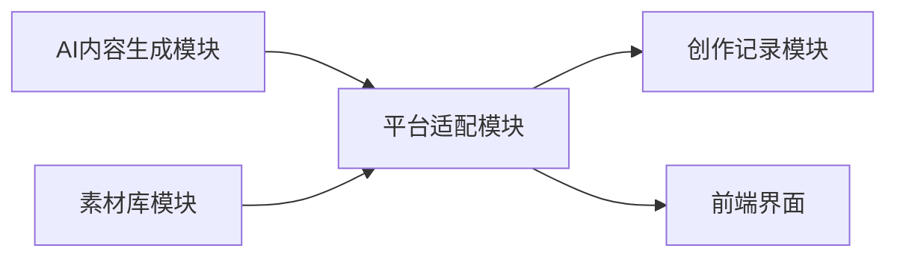
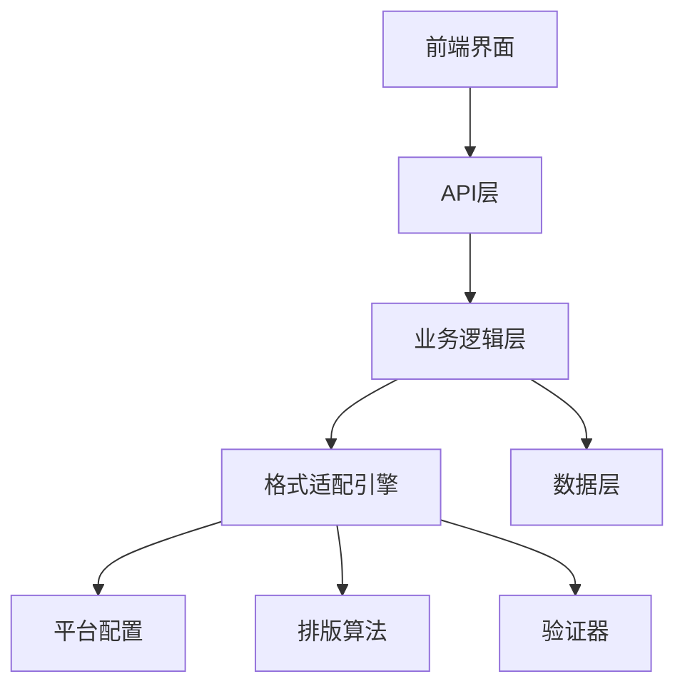
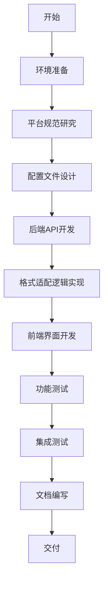

# 平台适配模块开发指南

---

**文档版本**: 1.0  
**编制日期**: 2026年2月  
**编制人**: 平台适配模块负责人  
**审核人**: 技术负责人  
**适用角色**: 平台适配模块开发人员  

---

## 目录

1. [模块概述](#1-模块概述)
2. [核心任务](#2-核心任务)
3. [技术架构](#3-技术架构)
4. [开发工具与资源](#4-开发工具与资源)
5. [开发流程](#5-开发流程)
6. [具体操作步骤](#6-具体操作步骤)
7. [API接口规范](#7-api接口规范)
8. [平台格式规范](#8-平台格式规范)
9. [代码示例](#9-代码示例)
10. [测试指南](#10-测试指南)
11. [常见问题](#11-常见问题)
12. [交付成果](#12-交付成果)

---

## 1. 模块概述

### 1.1 模块定位

平台适配模块是"内容创作AI-Agent"项目的核心功能模块之一,负责将AI生成的内容自动适配到不同的自媒体平台(抖音、小红书、微信视频号)的格式要求,实现一键排版和预览功能。

### 1.2 模块职责

| 职责 | 描述 |
|------|------|
| 格式适配 | 将内容转换为各平台特定的格式规范 |
| 一键排版 | 自动调整内容的排版和样式 |
| 实时预览 | 提供适配后的内容预览功能 |
| 导出功能 | 支持导出适配后的内容 |
| 格式验证 | 验证内容是否符合平台格式要求 |

### 1.3 与其他模块的关系



---

## 2. 核心任务

### 2.1 功能任务清单

| 任务ID | 任务名称 | 优先级 | 预计工时 |
|--------|---------|--------|----------|
| PA-01 | 抖音格式适配 | 高 | 4小时 |
| PA-02 | 小红书格式适配 | 高 | 4小时 |
| PA-03 | 微信视频号格式适配 | 高 | 4小时 |
| PA-04 | 一键排版算法实现 | 高 | 6小时 |
| PA-05 | 实时预览功能 | 中 | 4小时 |
| PA-06 | 格式对比功能 | 中 | 3小时 |
| PA-07 | 导出功能实现 | 中 | 3小时 |
| PA-08 | 平台格式配置文件 | 高 | 2小时 |

### 2.2 任务详细说明

#### PA-01: 抖音格式适配
- **标题格式**: 最多30个字符,支持emoji
- **正文格式**: 分段显示,每段不超过500字符
- **标签格式**: #标签名,最多5个标签
- **特殊要求**: 
  - 标题需要吸引眼球,可使用emoji
  - 正文第一段为钩子,吸引用户停留
  - 标签需要与内容相关

#### PA-02: 小红书格式适配
- **笔记格式**: 标题+正文+标签
- **标题格式**: 最多20个字符,支持emoji
- **正文格式**: 支持分段,每段不超过300字符
- **标签格式**: #标签名,最多10个标签
- **封面要求**: 3:4比例图片
- **特殊要求**:
  - 标题需要简洁有力
  - 正文需要分段清晰,使用emoji分隔
  - 标签需要覆盖主要关键词

#### PA-03: 微信视频号格式适配
- **标题格式**: 最多30个字符
- **描述格式**: 最多200个字符
- **封面要求**: 16:9比例图片
- **特殊要求**:
  - 标题需要简洁明了
  - 描述需要概括内容要点
  - 封面需要高清清晰

#### PA-04: 一键排版算法实现
- **智能分段**: 根据内容语义自动分段
- **标点优化**: 自动调整标点符号
- **空格处理**: 优化中英文之间的空格
- **Emoji插入**: 根据内容类型插入合适的emoji
- **格式统一**: 统一各段落的格式风格

#### PA-05: 实时预览功能
- **即时渲染**: 用户输入时实时显示预览
- **多平台切换**: 支持快速切换不同平台预览
- **样式还原**: 还原各平台的实际显示效果
- **响应式布局**: 适配不同屏幕尺寸

#### PA-06: 格式对比功能
- **并排显示**: 同时显示原始格式和适配后格式
- **差异高亮**: 高亮显示格式变化的部分
- **版本切换**: 支持快速切换不同版本

#### PA-07: 导出功能实现
- **格式选择**: 支持导出为多种格式(TXT、Markdown、HTML)
- **批量导出**: 支持批量导出多个平台格式
- **模板保存**: 支持保存自定义导出模板

#### PA-08: 平台格式配置文件
- **配置管理**: 集中管理各平台的格式配置
- **易于扩展**: 方便添加新平台支持
- **版本控制**: 支持配置版本管理

---

## 3. 技术架构

### 3.1 整体架构



### 3.2 技术栈

| 层级 | 技术 | 版本 | 用途 |
|------|------|------|------|
| 前端 | Vue.js | 3.x | 用户界面 |
| 前端UI | Element Plus | 2.x | UI组件库 |
| 前端状态 | Pinia | 2.x | 状态管理 |
| 后端 | FastAPI | 0.100+ | API框架 |
| 后端语言 | Python | 3.9+ | 业务逻辑 |
| 数据验证 | Pydantic | 2.x | 数据验证 |
| 文本处理 | jieba | 0.42+ | 中文分词 |
| 配置管理 | PyYAML | 6.x | 配置文件 |

### 3.3 目录结构

```
backend/
├── app/
│   ├── api/
│   │   └── v1/
│   │       └── adapter.py          # 平台适配API
│   ├── models/
│   │   └── adapter.py              # 数据模型
│   ├── schemas/
│   │   └── adapter.py              # 请求/响应模式
│   ├── services/
│   │   ├── adapter_service.py      # 适配服务
│   │   ├── formatters/
│   │   │   ├── douyin.py           # 抖音格式化
│   │   │   ├── xiaohongshu.py      # 小红书格式化
│   │   │   └── wechat.py           # 微信视频号格式化
│   │   └── validators/
│   │       ├── douyin.py           # 抖音验证器
│   │       ├── xiaohongshu.py      # 小红书验证器
│   │       └── wechat.py           # 微信验证器
│   └── config/
│       └── platform_config.yaml    # 平台配置文件

frontend/src/
├── views/
│   └── adapter/
│       ├── PlatformAdapter.vue     # 主页面
│       ├── PreviewPanel.vue        # 预览面板
│       └── FormatCompare.vue       # 格式对比
├── components/
│   └── adapter/
│       ├── PlatformSelector.vue    # 平台选择器
│       ├── ContentEditor.vue       # 内容编辑器
│       └── ExportDialog.vue        # 导出对话框
├── api/
│   └── adapter.js                  # API调用
└── stores/
    └── adapter.js                  # 状态管理
```

---

## 4. 开发工具与资源

### 4.1 必需工具

| 工具名称 | 用途 | 安装方式 |
|---------|------|---------|
| VS Code | 代码编辑器 | https://code.visualstudio.com/ |
| Python 3.9+ | 后端开发语言 | https://www.python.org/downloads/ |
| Node.js 16+ | 前端开发环境 | https://nodejs.org/ |
| Git | 版本控制 | https://git-scm.com/ |
| Postman | API测试 | https://www.postman.com/ |

### 4.2 可选工具

| 工具名称 | 用途 | 说明 |
|---------|------|------|
| PyCharm | Python IDE | 提供更好的Python开发体验 |
| Chrome DevTools | 前端调试 | 浏览器内置工具 |
| Figma | 界面设计 | 设计UI原型 |
| Draw.io | 架构图绘制 | 绘制流程图和架构图 |

### 4.3 Python依赖包

```bash
# 后端核心依赖
fastapi==0.104.1
uvicorn==0.24.0
pydantic==2.5.0
pydantic-settings==2.1.0
sqlalchemy==2.0.23
python-multipart==0.0.6

# 文本处理
jieba==0.42.1
regex==2023.10.3

# 配置管理
pyyaml==6.0.1

# 测试
pytest==7.4.3
pytest-asyncio==0.21.1
httpx==0.25.2
```

### 4.4 前端依赖包

```json
{
  "dependencies": {
    "vue": "^3.3.8",
    "vue-router": "^4.2.5",
    "pinia": "^2.1.7",
    "element-plus": "^2.4.4",
    "axios": "^1.6.2",
    "@element-plus/icons-vue": "^2.3.1"
  },
  "devDependencies": {
    "@vitejs/plugin-vue": "^4.5.0",
    "vite": "^5.0.4",
    "eslint": "^8.54.0",
    "prettier": "^3.1.0"
  }
}
```

### 4.5 参考资源

| 资源名称 | 链接 | 用途 |
|---------|------|------|
| FastAPI文档 | https://fastapi.tiangolo.com/ | 后端框架参考 |
| Vue.js文档 | https://cn.vuejs.org/ | 前端框架参考 |
| Element Plus | https://element-plus.org/zh-CN/ | UI组件库 |
| 抖音创作规范 | https://creator.douyin.com/ | 抖音格式规范 |
| 小红书创作规范 | https://www.xiaohongshu.com/ | 小红书格式规范 |
| 微信视频号规范 | https://channels.weixin.qq.com/ | 微信视频号规范 |

---

## 5. 开发流程

### 5.1 整体流程



### 5.2 时间安排(3天)

| 天数 | 任务 | 详细内容 |
|------|------|---------|
| **第1天** | 平台规范研究 | 研究各平台格式规范,设计配置文件,创建基础结构 |
| **第2天** | 适配逻辑实现 | 实现各平台格式适配逻辑,一键排版算法,API开发 |
| **第3天** | 前端界面开发 | 实现前端界面,实时预览,导出功能,测试 |

### 5.3 每日任务分解

#### 第1天: 平台规范研究

**上午 (4小时)**
- [ ] 研究抖音格式规范(1小时)
- [ ] 研究小红书格式规范(1小时)
- [ ] 研究微信视频号格式规范(1小时)
- [ ] 整理平台规范对比表(1小时)

**下午 (4小时)**
- [ ] 设计平台配置文件结构(1小时)
- [ ] 创建配置文件 `platform_config.yaml`(1小时)
- [ ] 创建后端基础目录结构(1小时)
- [ ] 创建前端基础目录结构(1小时)

#### 第2天: 适配逻辑实现

**上午 (4小时)**
- [ ] 实现抖音格式适配逻辑(1.5小时)
- [ ] 实现小红书格式适配逻辑(1.5小时)
- [ ] 实现微信视频号格式适配逻辑(1小时)

**下午 (4小时)**
- [ ] 实现一键排版算法(2小时)
- [ ] 实现格式验证器(1小时)
- [ ] 开发API接口(1小时)

#### 第3天: 前端界面开发

**上午 (4小时)**
- [ ] 实现平台选择组件(1小时)
- [ ] 实现内容编辑器(1.5小时)
- [ ] 实现实时预览功能(1.5小时)

**下午 (4小时)**
- [ ] 实现格式对比功能(1小时)
- [ ] 实现导出功能(1小时)
- [ ] 功能测试和Bug修复(2小时)

---

## 6. 具体操作步骤

### 6.1 环境准备

#### 步骤1: 安装开发工具

```bash
# 1. 安装Python 3.9+
# 访问 https://www.python.org/downloads/ 下载并安装

# 2. 安装Node.js 16+
# 访问 https://nodejs.org/ 下载并安装

# 3. 安装VS Code
# 访问 https://code.visualstudio.com/ 下载并安装

# 4. 安装Git
# 访问 https://git-scm.com/ 下载并安装
```

#### 步骤2: 克隆项目

```bash
# 克隆项目到本地
git clone <项目仓库地址>
cd 内容创作AI-Agent
```

#### 步骤3: 配置后端环境

```bash
# 进入后端目录
cd backend

# 创建虚拟环境
python -m venv venv

# 激活虚拟环境
# Windows:
venv\Scripts\activate
# Linux/Mac:
source venv/bin/activate

# 安装依赖
pip install -r requirements.txt
```

#### 步骤4: 配置前端环境

```bash
# 进入前端目录
cd frontend

# 安装依赖
npm install
```

### 6.2 平台规范研究

#### 步骤1: 收集平台规范

访问各平台的官方文档,收集格式规范:

1. **抖音创作规范**
   - 访问: https://creator.douyin.com/
   - 关注: 标题长度、正文格式、标签规则、封面要求

2. **小红书创作规范**
   - 访问: https://www.xiaohongshu.com/
   - 关注: 笔记格式、标题限制、标签数量、封面比例

3. **微信视频号规范**
   - 访问: https://channels.weixin.qq.com/
   - 关注: 标题要求、描述长度、封面规格

#### 步骤2: 整理规范对比表

创建 `docs/platform_specs_comparison.md`:

```markdown
# 平台格式规范对比表

| 规范项 | 抖音 | 小红书 | 微信视频号 |
|--------|------|--------|-----------|
| 标题长度 | 最多30字符 | 最多20字符 | 最多30字符 |
| 正文分段 | 每段≤500字符 | 每段≤300字符 | 描述≤200字符 |
| 标签数量 | 最多5个 | 最多10个 | 不支持 |
| 封面比例 | 9:16 | 3:4 | 16:9 |
| Emoji支持 | 支持 | 支持 | 不支持 |
```

### 6.3 配置文件设计

#### 步骤1: 创建平台配置文件

创建 `backend/app/config/platform_config.yaml`:

```yaml
platforms:
  douyin:
    name: "抖音"
    code: "douyin"
    title:
      max_length: 30
      emoji_enabled: true
      tips: "标题需要吸引眼球,可使用emoji"
    content:
      max_length: 2000
      paragraph_max_length: 500
      tips: "正文第一段为钩子,吸引用户停留"
    tags:
      max_count: 5
      format: "#{tag}"
      tips: "标签需要与内容相关"
    cover:
      ratio: "9:16"
      tips: "竖屏高清图片"
    
  xiaohongshu:
    name: "小红书"
    code: "xiaohongshu"
    title:
      max_length: 20
      emoji_enabled: true
      tips: "标题需要简洁有力"
    content:
      max_length: 1000
      paragraph_max_length: 300
      tips: "正文需要分段清晰,使用emoji分隔"
    tags:
      max_count: 10
      format: "#{tag}"
      tips: "标签需要覆盖主要关键词"
    cover:
      ratio: "3:4"
      tips: "3:4比例高清图片"
    
  wechat:
    name: "微信视频号"
    code: "wechat"
    title:
      max_length: 30
      emoji_enabled: false
      tips: "标题需要简洁明了"
    content:
      max_length: 200
      paragraph_max_length: 200
      tips: "描述需要概括内容要点"
    tags:
      max_count: 0
      format: ""
      tips: "不支持标签"
    cover:
      ratio: "16:9"
      tips: "16:9比例高清图片"

formatting_rules:
  auto_paragraph: true
  emoji_insertion: true
  space_optimization: true
  punctuation_optimization: true
```

#### 步骤2: 创建配置加载器

创建 `backend/app/config/platform_config.py`:

```python
import yaml
from pathlib import Path
from typing import Dict, Any

class PlatformConfig:
    """平台配置管理器"""
    
    def __init__(self, config_path: str = None):
        if config_path is None:
            config_path = Path(__file__).parent / "platform_config.yaml"
        self.config_path = Path(config_path)
        self.config = self._load_config()
    
    def _load_config(self) -> Dict[str, Any]:
        """加载配置文件"""
        with open(self.config_path, 'r', encoding='utf-8') as f:
            return yaml.safe_load(f)
    
    def get_platform_config(self, platform: str) -> Dict[str, Any]:
        """获取指定平台的配置"""
        platforms = self.config.get('platforms', {})
        return platforms.get(platform, {})
    
    def get_all_platforms(self) -> Dict[str, Any]:
        """获取所有平台配置"""
        return self.config.get('platforms', {})
    
    def get_formatting_rules(self) -> Dict[str, Any]:
        """获取格式化规则"""
        return self.config.get('formatting_rules', {})

# 全局配置实例
platform_config = PlatformConfig()
```

### 6.4 后端API开发

#### 步骤1: 创建数据模型

创建 `backend/app/schemas/adapter.py`:

```python
from pydantic import BaseModel, Field, validator
from typing import Optional, List, Dict
from enum import Enum

class PlatformEnum(str, Enum):
    """支持的平台枚举"""
    DOUYIN = "douyin"
    XIAOHONGSHU = "xiaohongshu"
    WECHAT = "wechat"

class ContentRequest(BaseModel):
    """内容适配请求"""
    content: str = Field(..., description="原始内容")
    platform: PlatformEnum = Field(..., description="目标平台")
    title: Optional[str] = Field(None, description="标题")
    tags: Optional[List[str]] = Field(None, description="标签列表")
    auto_format: bool = Field(True, description="是否自动排版")
    
    @validator('content')
    def validate_content(cls, v):
        if not v or not v.strip():
            raise ValueError("内容不能为空")
        return v.strip()

class FormatResult(BaseModel):
    """格式化结果"""
    title: str
    content: str
    tags: List[str]
    preview: str
    warnings: List[str] = []
    suggestions: List[str] = []

class AdapterResponse(BaseModel):
    """适配响应"""
    code: int = 200
    message: str = "适配成功"
    data: FormatResult

class ValidationError(BaseModel):
    """验证错误"""
    field: str
    message: str
    value: str
```

#### 步骤2: 创建格式化器基类

创建 `backend/app/services/formatters/base.py`:

```python
from abc import ABC, abstractmethod
from typing import Dict, List, Tuple
import re

class BaseFormatter(ABC):
    """格式化器基类"""
    
    def __init__(self, config: Dict):
        self.config = config
        self.title_config = config.get('title', {})
        self.content_config = config.get('content', {})
        self.tags_config = config.get('tags', {})
        self.cover_config = config.get('cover', {})
    
    @abstractmethod
    def format_title(self, title: str) -> Tuple[str, List[str]]:
        """格式化标题"""
        pass
    
    @abstractmethod
    def format_content(self, content: str) -> Tuple[str, List[str]]:
        """格式化内容"""
        pass
    
    @abstractmethod
    def format_tags(self, tags: List[str]) -> Tuple[List[str], List[str]]:
        """格式化标签"""
        pass
    
    def _truncate_text(self, text: str, max_length: int, suffix: str = "...") -> str:
        """截断文本"""
        if len(text) <= max_length:
            return text
        return text[:max_length - len(suffix)] + suffix
    
    def _split_paragraphs(self, content: str, max_length: int) -> List[str]:
        """分割段落"""
        paragraphs = []
        current = ""
        
        for line in content.split('\n'):
            line = line.strip()
            if not line:
                if current:
                    paragraphs.append(current)
                    current = ""
                continue
            
            if len(current) + len(line) <= max_length:
                current += line + '\n'
            else:
                if current:
                    paragraphs.append(current)
                current = line + '\n'
        
        if current:
            paragraphs.append(current)
        
        return paragraphs
    
    def _optimize_punctuation(self, text: str) -> str:
        """优化标点符号"""
        # 统一中文标点
        text = text.replace(',', '，').replace('.', '。')
        text = text.replace('!', '！').replace('?', '？')
        
        # 移除多余空格
        text = re.sub(r'\s+', '', text)
        
        return text
    
    def _optimize_spaces(self, text: str) -> str:
        """优化中英文之间的空格"""
        # 在中文和英文/数字之间添加空格
        text = re.sub(r'([\u4e00-\u9fa5])([a-zA-Z0-9])', r'\1 \2', text)
        text = re.sub(r'([a-zA-Z0-9])([\u4e00-\u9fa5])', r'\1 \2', text)
        return text
```

#### 步骤3: 实现抖音格式化器

创建 `backend/app/services/formatters/douyin.py`:

```python
from typing import Dict, List, Tuple
from .base import BaseFormatter

class DouyinFormatter(BaseFormatter):
    """抖音格式化器"""
    
    def format_title(self, title: str) -> Tuple[str, List[str]]:
        """格式化标题"""
        max_length = self.title_config.get('max_length', 30)
        warnings = []
        
        # 截断标题
        formatted_title = self._truncate_text(title, max_length)
        
        if len(title) > max_length:
            warnings.append(f"标题超过{max_length}字符,已自动截断")
        
        return formatted_title, warnings
    
    def format_content(self, content: str) -> Tuple[str, List[str]]:
        """格式化内容"""
        max_length = self.content_config.get('max_length', 2000)
        paragraph_max = self.content_config.get('paragraph_max_length', 500)
        warnings = []
        
        # 优化标点和空格
        content = self._optimize_punctuation(content)
        content = self._optimize_spaces(content)
        
        # 分段处理
        paragraphs = self._split_paragraphs(content, paragraph_max)
        formatted_content = '\n\n'.join(p.strip() for p in paragraphs)
        
        # 检查总长度
        if len(formatted_content) > max_length:
            warnings.append(f"内容超过{max_length}字符,可能影响显示效果")
        
        return formatted_content, warnings
    
    def format_tags(self, tags: List[str]) -> Tuple[List[str], List[str]]:
        """格式化标签"""
        max_count = self.tags_config.get('max_count', 5)
        tag_format = self.tags_config.get('format', '#{tag}')
        warnings = []
        
        # 限制标签数量
        if len(tags) > max_count:
            tags = tags[:max_count]
            warnings.append(f"标签超过{max_count}个,已自动保留前{max_count}个")
        
        # 格式化标签
        formatted_tags = [tag_format.format(tag=tag) for tag in tags]
        
        return formatted_tags, warnings
```

#### 步骤4: 实现小红书格式化器

创建 `backend/app/services/formatters/xiaohongshu.py`:

```python
from typing import Dict, List, Tuple
from .base import BaseFormatter

class XiaohongshuFormatter(BaseFormatter):
    """小红书格式化器"""
    
    def format_title(self, title: str) -> Tuple[str, List[str]]:
        """格式化标题"""
        max_length = self.title_config.get('max_length', 20)
        warnings = []
        
        # 截断标题
        formatted_title = self._truncate_text(title, max_length)
        
        if len(title) > max_length:
            warnings.append(f"标题超过{max_length}字符,已自动截断")
        
        return formatted_title, warnings
    
    def format_content(self, content: str) -> Tuple[str, List[str]]:
        """格式化内容"""
        max_length = self.content_config.get('max_length', 1000)
        paragraph_max = self.content_config.get('paragraph_max_length', 300)
        warnings = []
        
        # 优化标点和空格
        content = self._optimize_punctuation(content)
        content = self._optimize_spaces(content)
        
        # 分段处理
        paragraphs = self._split_paragraphs(content, paragraph_max)
        
        # 添加emoji分隔
        emojis = ['📌', '✨', '💡', '🎯', '🔥', '💪']
        formatted_paragraphs = []
        for i, p in enumerate(paragraphs):
            emoji = emojis[i % len(emojis)]
            formatted_paragraphs.append(f"{emoji} {p.strip()}")
        
        formatted_content = '\n\n'.join(formatted_paragraphs)
        
        # 检查总长度
        if len(formatted_content) > max_length:
            warnings.append(f"内容超过{max_length}字符,可能影响显示效果")
        
        return formatted_content, warnings
    
    def format_tags(self, tags: List[str]) -> Tuple[List[str], List[str]]:
        """格式化标签"""
        max_count = self.tags_config.get('max_count', 10)
        tag_format = self.tags_config.get('format', '#{tag}')
        warnings = []
        
        # 限制标签数量
        if len(tags) > max_count:
            tags = tags[:max_count]
            warnings.append(f"标签超过{max_count}个,已自动保留前{max_count}个")
        
        # 格式化标签
        formatted_tags = [tag_format.format(tag=tag) for tag in tags]
        
        return formatted_tags, warnings
```

#### 步骤5: 实现微信视频号格式化器

创建 `backend/app/services/formatters/wechat.py`:

```python
from typing import Dict, List, Tuple
from .base import BaseFormatter

class WechatFormatter(BaseFormatter):
    """微信视频号格式化器"""
    
    def format_title(self, title: str) -> Tuple[str, List[str]]:
        """格式化标题"""
        max_length = self.title_config.get('max_length', 30)
        warnings = []
        
        # 截断标题
        formatted_title = self._truncate_text(title, max_length)
        
        if len(title) > max_length:
            warnings.append(f"标题超过{max_length}字符,已自动截断")
        
        return formatted_title, warnings
    
    def format_content(self, content: str) -> Tuple[str, List[str]]:
        """格式化内容"""
        max_length = self.content_config.get('max_length', 200)
        warnings = []
        
        # 优化标点和空格
        content = self._optimize_punctuation(content)
        content = self._optimize_spaces(content)
        
        # 截断内容
        formatted_content = self._truncate_text(content, max_length)
        
        if len(content) > max_length:
            warnings.append(f"描述超过{max_length}字符,已自动截断")
        
        return formatted_content, warnings
    
    def format_tags(self, tags: List[str]) -> Tuple[List[str], List[str]]:
        """格式化标签"""
        warnings = []
        
        # 微信视频号不支持标签
        if tags:
            warnings.append("微信视频号不支持标签,标签已忽略")
        
        return [], warnings
```

#### 步骤6: 创建适配服务

创建 `backend/app/services/adapter_service.py`:

```python
from typing import Dict, List, Optional
from ..config.platform_config import platform_config
from .formatters.douyin import DouyinFormatter
from .formatters.xiaohongshu import XiaohongshuFormatter
from .formatters.wechat import WechatFormatter
from ..schemas.adapter import FormatResult

class AdapterService:
    """平台适配服务"""
    
    def __init__(self):
        self.formatters = {
            'douyin': DouyinFormatter,
            'xiaohongshu': XiaohongshuFormatter,
            'wechat': WechatFormatter
        }
    
    def adapt_content(
        self,
        content: str,
        platform: str,
        title: Optional[str] = None,
        tags: Optional[List[str]] = None,
        auto_format: bool = True
    ) -> FormatResult:
        """适配内容到指定平台"""
        
        # 获取平台配置
        platform_config_data = platform_config.get_platform_config(platform)
        
        if not platform_config_data:
            raise ValueError(f"不支持的平台: {platform}")
        
        # 获取格式化器
        formatter_class = self.formatters.get(platform)
        if not formatter_class:
            raise ValueError(f"未找到平台格式化器: {platform}")
        
        formatter = formatter_class(platform_config_data)
        
        # 格式化内容
        warnings = []
        suggestions = []
        
        # 格式化标题
        if title:
            formatted_title, title_warnings = formatter.format_title(title)
            warnings.extend(title_warnings)
        else:
            formatted_title = self._generate_title(content)
            suggestions.append("已自动生成标题")
        
        # 格式化正文
        formatted_content, content_warnings = formatter.format_content(content)
        warnings.extend(content_warnings)
        
        # 格式化标签
        if tags:
            formatted_tags, tags_warnings = formatter.format_tags(tags)
            warnings.extend(tags_warnings)
        else:
            formatted_tags = self._extract_tags(content)
            suggestions.append("已自动提取标签")
        
        # 生成预览
        preview = self._generate_preview(
            formatted_title,
            formatted_content,
            formatted_tags,
            platform
        )
        
        return FormatResult(
            title=formatted_title,
            content=formatted_content,
            tags=formatted_tags,
            preview=preview,
            warnings=warnings,
            suggestions=suggestions
        )
    
    def _generate_title(self, content: str) -> str:
        """从内容生成标题"""
        # 简单实现:取第一句话的前20个字符
        first_sentence = content.split('。')[0].split('\n')[0]
        return first_sentence[:20]
    
    def _extract_tags(self, content: str) -> List[str]:
        """从内容提取标签"""
        # 简单实现:提取关键词
        # 实际项目中可以使用jieba分词
        keywords = ['热点', '推荐', '分享', '干货', '教程']
        return keywords[:3]
    
    def _generate_preview(
        self,
        title: str,
        content: str,
        tags: List[str],
        platform: str
    ) -> str:
        """生成预览"""
        tag_str = ' '.join(tags)
        return f"{title}\n\n{content}\n\n{tag_str}"

# 全局服务实例
adapter_service = AdapterService()
```

#### 步骤7: 创建API路由

创建 `backend/app/api/v1/adapter.py`:

```python
from fastapi import APIRouter, HTTPException
from ...schemas.adapter import (
    ContentRequest,
    AdapterResponse,
    PlatformEnum
)
from ...services.adapter_service import adapter_service

router = APIRouter(prefix="/adapter", tags=["平台适配"])

@router.post("/adapt", response_model=AdapterResponse)
async def adapt_content(request: ContentRequest):
    """适配内容到指定平台"""
    try:
        result = adapter_service.adapt_content(
            content=request.content,
            platform=request.platform.value,
            title=request.title,
            tags=request.tags,
            auto_format=request.auto_format
        )
        
        return AdapterResponse(
            code=200,
            message="适配成功",
            data=result
        )
    except ValueError as e:
        raise HTTPException(status_code=400, detail=str(e))
    except Exception as e:
        raise HTTPException(status_code=500, detail=f"适配失败: {str(e)}")

@router.get("/platforms")
async def get_platforms():
    """获取支持的平台列表"""
    from ...config.platform_config import platform_config
    
    platforms = platform_config.get_all_platforms()
    
    return {
        "code": 200,
        "message": "获取成功",
        "data": [
            {
                "code": code,
                "name": config.get("name", ""),
                "title": config.get("title", {}),
                "content": config.get("content", {}),
                "tags": config.get("tags", {}),
                "cover": config.get("cover", {})
            }
            for code, config in platforms.items()
        ]
    }
```

#### 步骤8: 注册路由

修改 `backend/app/main.py`:

```python
from fastapi import FastAPI
from app.api.v1 import adapter

app = FastAPI(title="内容创作AI-Agent API")

# 注册路由
app.include_router(adapter.router, prefix="/api/v1")

@app.get("/")
async def root():
    return {"message": "内容创作AI-Agent API"}
```

### 6.5 前端界面开发

#### 步骤1: 创建API调用模块

创建 `frontend/src/api/adapter.js`:

```javascript
import axios from 'axios';

const BASE_URL = 'http://localhost:8000/api/v1';

// 适配内容
export const adaptContent = async (data) => {
  const response = await axios.post(`${BASE_URL}/adapter/adapt`, data);
  return response.data;
};

// 获取平台列表
export const getPlatforms = async () => {
  const response = await axios.get(`${BASE_URL}/adapter/platforms`);
  return response.data;
};
```

#### 步骤2: 创建状态管理

创建 `frontend/src/stores/adapter.js`:

```javascript
import { defineStore } from 'pinia';
import { adaptContent, getPlatforms } from '@/api/adapter';

export const useAdapterStore = defineStore('adapter', {
  state: () => ({
    platforms: [],
    selectedPlatform: 'douyin',
    originalContent: '',
    adaptedResult: null,
    loading: false,
    error: null
  }),

  actions: {
    async fetchPlatforms() {
      try {
        const response = await getPlatforms();
        this.platforms = response.data;
      } catch (error) {
        this.error = error.message;
      }
    },

    async adaptContent(content, platform, title, tags) {
      this.loading = true;
      this.error = null;
      
      try {
        const response = await adaptContent({
          content,
          platform,
          title,
          tags,
          auto_format: true
        });
        
        this.adaptedResult = response.data;
        return response.data;
      } catch (error) {
        this.error = error.message;
        throw error;
      } finally {
        this.loading = false;
      }
    },

    setPlatform(platform) {
      this.selectedPlatform = platform;
    },

    setOriginalContent(content) {
      this.originalContent = content;
    }
  }
});
```

#### 步骤3: 创建平台选择器组件

创建 `frontend/src/components/adapter/PlatformSelector.vue`:

```vue
<template>
  <el-card class="platform-selector">
    <template #header>
      <span>选择平台</span>
    </template>
    
    <el-radio-group v-model="selectedPlatform" @change="handlePlatformChange">
      <el-radio-button 
        v-for="platform in platforms" 
        :key="platform.code"
        :label="platform.code"
      >
        {{ platform.name }}
      </el-radio-button>
    </el-radio-group>
    
    <div v-if="selectedPlatformConfig" class="platform-info">
      <el-descriptions :column="2" border>
        <el-descriptions-item label="标题限制">
          最多{{ selectedPlatformConfig.title.max_length }}字符
        </el-descriptions-item>
        <el-descriptions-item label="正文限制">
          最多{{ selectedPlatformConfig.content.max_length }}字符
        </el-descriptions-item>
        <el-descriptions-item label="标签数量">
          最多{{ selectedPlatformConfig.tags.max_count }}个
        </el-descriptions-item>
        <el-descriptions-item label="封面比例">
          {{ selectedPlatformConfig.cover.ratio }}
        </el-descriptions-item>
      </el-descriptions>
    </div>
  </el-card>
</template>

<script setup>
import { computed, onMounted } from 'vue';
import { useAdapterStore } from '@/stores/adapter';

const adapterStore = useAdapterStore();

const selectedPlatform = computed({
  get: () => adapterStore.selectedPlatform,
  set: (value) => adapterStore.setPlatform(value)
});

const platforms = computed(() => adapterStore.platforms);

const selectedPlatformConfig = computed(() => {
  return platforms.value.find(p => p.code === selectedPlatform.value);
});

const handlePlatformChange = (value) => {
  console.log('平台切换:', value);
};

onMounted(() => {
  adapterStore.fetchPlatforms();
});
</script>

<style scoped>
.platform-selector {
  margin-bottom: 20px;
}

.platform-info {
  margin-top: 20px;
}
</style>
```

#### 步骤4: 创建内容编辑器组件

创建 `frontend/src/components/adapter/ContentEditor.vue`:

```vue
<template>
  <el-card class="content-editor">
    <template #header>
      <span>内容编辑</span>
    </template>
    
    <el-form :model="formData" label-width="80px">
      <el-form-item label="标题">
        <el-input
          v-model="formData.title"
          placeholder="请输入标题"
          maxlength="30"
          show-word-limit
        />
      </el-form-item>
      
      <el-form-item label="正文">
        <el-input
          v-model="formData.content"
          type="textarea"
          :rows="10"
          placeholder="请输入正文内容"
          @input="handleContentChange"
        />
      </el-form-item>
      
      <el-form-item label="标签">
        <el-select
          v-model="formData.tags"
          multiple
          filterable
          allow-create
          placeholder="请选择或输入标签"
          style="width: 100%"
        >
          <el-option
            v-for="tag in commonTags"
            :key="tag"
            :label="tag"
            :value="tag"
          />
        </el-select>
      </el-form-item>
      
      <el-form-item>
        <el-button type="primary" @click="handleAdapt" :loading="loading">
          一键适配
        </el-button>
        <el-button @click="handleReset">重置</el-button>
      </el-form-item>
    </el-form>
  </el-card>
</template>

<script setup>
import { reactive, ref } from 'vue';
import { useAdapterStore } from '@/stores/adapter';

const emit = defineEmits(['adapt']);

const adapterStore = useAdapterStore();

const formData = reactive({
  title: '',
  content: '',
  tags: []
});

const loading = ref(false);

const commonTags = [
  '热点', '推荐', '分享', '干货', '教程',
  '生活', '美食', '旅行', '科技', '娱乐'
];

const handleContentChange = () => {
  adapterStore.setOriginalContent(formData.content);
};

const handleAdapt = async () => {
  if (!formData.content) {
    ElMessage.warning('请输入正文内容');
    return;
  }
  
  loading.value = true;
  
  try {
    const result = await adapterStore.adaptContent(
      formData.content,
      adapterStore.selectedPlatform,
      formData.title,
      formData.tags
    );
    
    emit('adapt', result);
    ElMessage.success('适配成功');
  } catch (error) {
    ElMessage.error('适配失败: ' + error.message);
  } finally {
    loading.value = false;
  }
};

const handleReset = () => {
  formData.title = '';
  formData.content = '';
  formData.tags = [];
  adapterStore.adaptedResult = null;
};
</script>

<style scoped>
.content-editor {
  margin-bottom: 20px;
}
</style>
```

#### 步骤5: 创建预览面板组件

创建 `frontend/src/components/adapter/PreviewPanel.vue`:

```vue
<template>
  <el-card class="preview-panel">
    <template #header>
      <div class="panel-header">
        <span>预览效果</span>
        <el-button-group>
          <el-button size="small" @click="handleCopy">复制</el-button>
          <el-button size="small" @click="handleExport">导出</el-button>
        </el-button-group>
      </div>
    </template>
    
    <div v-if="adaptedResult" class="preview-content">
      <div class="preview-title">{{ adaptedResult.title }}</div>
      <div class="preview-body">{{ adaptedResult.content }}</div>
      <div class="preview-tags">
        <el-tag
          v-for="tag in adaptedResult.tags"
          :key="tag"
          type="info"
          class="tag-item"
        >
          {{ tag }}
        </el-tag>
      </div>
      
      <el-divider />
      
      <div v-if="adaptedResult.warnings.length > 0" class="warnings">
        <el-alert
          v-for="(warning, index) in adaptedResult.warnings"
          :key="index"
          type="warning"
          :closable="false"
          class="warning-item"
        >
          {{ warning }}
        </el-alert>
      </div>
      
      <div v-if="adaptedResult.suggestions.length > 0" class="suggestions">
        <el-alert
          v-for="(suggestion, index) in adaptedResult.suggestions"
          :key="index"
          type="info"
          :closable="false"
          class="suggestion-item"
        >
          {{ suggestion }}
        </el-alert>
      </div>
    </div>
    
    <el-empty v-else description="暂无预览内容" />
  </el-card>
</template>

<script setup>
import { computed } from 'vue';
import { useAdapterStore } from '@/stores/adapter';
import { ElMessage } from 'element-plus';

const adapterStore = useAdapterStore();

const adaptedResult = computed(() => adapterStore.adaptedResult);

const handleCopy = () => {
  if (!adaptedResult.value) return;
  
  const text = `${adaptedResult.value.title}\n\n${adaptedResult.value.content}\n\n${adaptedResult.value.tags.join(' ')}`;
  
  navigator.clipboard.writeText(text).then(() => {
    ElMessage.success('已复制到剪贴板');
  }).catch(() => {
    ElMessage.error('复制失败');
  });
};

const handleExport = () => {
  if (!adaptedResult.value) return;
  
  const text = `${adaptedResult.value.title}\n\n${adaptedResult.value.content}\n\n${adaptedResult.value.tags.join(' ')}`;
  
  const blob = new Blob([text], { type: 'text/plain;charset=utf-8' });
  const url = URL.createObjectURL(blob);
  const link = document.createElement('a');
  link.href = url;
  link.download = `content_${adapterStore.selectedPlatform}.txt`;
  link.click();
  URL.revokeObjectURL(url);
  
  ElMessage.success('导出成功');
};
</script>

<style scoped>
.preview-panel {
  height: 100%;
}

.panel-header {
  display: flex;
  justify-content: space-between;
  align-items: center;
}

.preview-content {
  padding: 10px;
}

.preview-title {
  font-size: 18px;
  font-weight: bold;
  margin-bottom: 15px;
}

.preview-body {
  white-space: pre-wrap;
  line-height: 1.8;
  margin-bottom: 15px;
  color: #333;
}

.preview-tags {
  display: flex;
  flex-wrap: wrap;
  gap: 8px;
}

.tag-item {
  margin: 0;
}

.warnings,
.suggestions {
  margin-top: 15px;
}

.warning-item,
.suggestion-item {
  margin-bottom: 10px;
}
</style>
```

#### 步骤6: 创建主页面

创建 `frontend/src/views/adapter/PlatformAdapter.vue`:

```vue
<template>
  <div class="platform-adapter">
    <el-row :gutter="20">
      <el-col :span="8">
        <PlatformSelector />
        <ContentEditor @adapt="handleAdapt" />
      </el-col>
      <el-col :span="16">
        <PreviewPanel />
      </el-col>
    </el-row>
  </div>
</template>

<script setup>
import PlatformSelector from '@/components/adapter/PlatformSelector.vue';
import ContentEditor from '@/components/adapter/ContentEditor.vue';
import PreviewPanel from '@/components/adapter/PreviewPanel.vue';

const handleAdapt = (result) => {
  console.log('适配结果:', result);
};
</script>

<style scoped>
.platform-adapter {
  padding: 20px;
}
</style>
```

#### 步骤7: 配置路由

修改 `frontend/src/router/index.js`:

```javascript
import { createRouter, createWebHistory } from 'vue-router';

const routes = [
  {
    path: '/',
    redirect: '/adapter'
  },
  {
    path: '/adapter',
    name: 'PlatformAdapter',
    component: () => import('@/views/adapter/PlatformAdapter.vue')
  }
];

const router = createRouter({
  history: createWebHistory(),
  routes
});

export default router;
```

### 6.6 测试指南

#### 步骤1: 后端测试

创建 `backend/tests/test_adapter.py`:

```python
import pytest
from fastapi.testclient import TestClient
from app.main import app

client = TestClient(app)

def test_adapt_content_douyin():
    """测试抖音内容适配"""
    response = client.post(
        "/api/v1/adapter/adapt",
        json={
            "content": "这是一段测试内容,用于测试平台适配功能。",
            "platform": "douyin",
            "title": "测试标题",
            "tags": ["测试", "适配"],
            "auto_format": True
        }
    )
    
    assert response.status_code == 200
    data = response.json()
    assert data["code"] == 200
    assert "title" in data["data"]
    assert "content" in data["data"]
    assert "tags" in data["data"]

def test_adapt_content_xiaohongshu():
    """测试小红书内容适配"""
    response = client.post(
        "/api/v1/adapter/adapt",
        json={
            "content": "这是一段测试内容,用于测试平台适配功能。",
            "platform": "xiaohongshu",
            "title": "测试标题",
            "tags": ["测试", "适配"],
            "auto_format": True
        }
    )
    
    assert response.status_code == 200
    data = response.json()
    assert data["code"] == 200

def test_get_platforms():
    """测试获取平台列表"""
    response = client.get("/api/v1/adapter/platforms")
    
    assert response.status_code == 200
    data = response.json()
    assert data["code"] == 200
    assert len(data["data"]) == 3

def test_invalid_platform():
    """测试无效平台"""
    response = client.post(
        "/api/v1/adapter/adapt",
        json={
            "content": "测试内容",
            "platform": "invalid",
            "title": "测试标题"
        }
    )
    
    assert response.status_code == 422  # 验证错误

def test_empty_content():
    """测试空内容"""
    response = client.post(
        "/api/v1/adapter/adapt",
        json={
            "content": "",
            "platform": "douyin",
            "title": "测试标题"
        }
    )
    
    assert response.status_code == 422  # 验证错误
```

运行测试:

```bash
cd backend
pytest tests/test_adapter.py -v
```

#### 步骤2: 前端测试

使用浏览器手动测试:

1. 启动后端服务:
```bash
cd backend
uvicorn app.main:app --reload --port 8000
```

2. 启动前端服务:
```bash
cd frontend
npm run dev
```

3. 访问 `http://localhost:5173` 进行测试

测试用例:
- [ ] 选择不同平台,查看平台信息是否正确显示
- [ ] 输入内容,点击"一键适配",查看是否正常适配
- [ ] 检查适配后的标题、正文、标签格式是否正确
- [ ] 检查警告和建议是否正确显示
- [ ] 测试复制功能
- [ ] 测试导出功能
- [ ] 测试重置功能

---

## 7. API接口规范

### 7.1 适配内容接口

**接口地址**: `POST /api/v1/adapter/adapt`

**请求参数**:

| 参数名 | 类型 | 必填 | 说明 |
|--------|------|------|------|
| content | string | 是 | 原始内容 |
| platform | string | 是 | 目标平台(douyin/xiaohongshu/wechat) |
| title | string | 否 | 标题 |
| tags | array | 否 | 标签列表 |
| auto_format | boolean | 否 | 是否自动排版,默认true |

**请求示例**:

```json
{
  "content": "这是一段测试内容,用于测试平台适配功能。",
  "platform": "douyin",
  "title": "测试标题",
  "tags": ["测试", "适配"],
  "auto_format": true
}
```

**响应示例**:

```json
{
  "code": 200,
  "message": "适配成功",
  "data": {
    "title": "测试标题",
    "content": "这是一段测试内容,用于测试平台适配功能。",
    "tags": ["#测试", "#适配"],
    "preview": "测试标题\n\n这是一段测试内容,用于测试平台适配功能。\n\n#测试 #适配",
    "warnings": [],
    "suggestions": []
  }
}
```

### 7.2 获取平台列表接口

**接口地址**: `GET /api/v1/adapter/platforms`

**响应示例**:

```json
{
  "code": 200,
  "message": "获取成功",
  "data": [
    {
      "code": "douyin",
      "name": "抖音",
      "title": {
        "max_length": 30,
        "emoji_enabled": true,
        "tips": "标题需要吸引眼球,可使用emoji"
      },
      "content": {
        "max_length": 2000,
        "paragraph_max_length": 500,
        "tips": "正文第一段为钩子,吸引用户停留"
      },
      "tags": {
        "max_count": 5,
        "format": "#{tag}",
        "tips": "标签需要与内容相关"
      },
      "cover": {
        "ratio": "9:16",
        "tips": "竖屏高清图片"
      }
    }
  ]
}
```

---

## 8. 平台格式规范

### 8.1 抖音格式规范

| 项目 | 规范 | 说明 |
|------|------|------|
| 标题长度 | 最多30字符 | 支持emoji |
| 正文长度 | 最多2000字符 | 分段显示 |
| 段落长度 | 每段≤500字符 | 自动分段 |
| 标签数量 | 最多5个 | 格式: #标签名 |
| 封面比例 | 9:16 | 竖屏高清 |
| Emoji支持 | 支持 | 标题和正文都支持 |

### 8.2 小红书格式规范

| 项目 | 规范 | 说明 |
|------|------|------|
| 标题长度 | 最多20字符 | 支持emoji |
| 正文长度 | 最多1000字符 | 分段显示 |
| 段落长度 | 每段≤300字符 | 自动分段+emoji |
| 标签数量 | 最多10个 | 格式: #标签名 |
| 封面比例 | 3:4 | 高清图片 |
| Emoji支持 | 支持 | 标题和正文都支持 |

### 8.3 微信视频号格式规范

| 项目 | 规范 | 说明 |
|------|------|------|
| 标题长度 | 最多30字符 | 不支持emoji |
| 描述长度 | 最多200字符 | 不分段 |
| 标签数量 | 不支持 | - |
| 封面比例 | 16:9 | 横屏高清 |
| Emoji支持 | 不支持 | - |

---

## 9. 代码示例

### 9.1 后端完整示例

详见第6.4节"后端API开发"部分。

### 9.2 前端完整示例

详见第6.5节"前端界面开发"部分。

---

## 10. 测试指南

### 10.1 单元测试

#### 后端单元测试

```bash
cd backend
pytest tests/test_adapter.py -v --cov=app/services/adapter_service
```

#### 前端单元测试

```bash
cd frontend
npm run test
```

### 10.2 集成测试

1. 启动后端服务
2. 启动前端服务
3. 使用Postman测试API接口
4. 使用浏览器测试前端功能

### 10.3 性能测试

使用Locust进行性能测试:

```python
from locust import HttpUser, task, between

class AdapterUser(HttpUser):
    wait_time = between(1, 3)
    
    @task
    def adapt_content(self):
        self.client.post(
            "/api/v1/adapter/adapt",
            json={
                "content": "这是一段测试内容",
                "platform": "douyin",
                "title": "测试标题",
                "tags": ["测试"],
                "auto_format": True
            }
        )
```

运行性能测试:

```bash
locust -f locustfile.py --host=http://localhost:8000
```

---

## 11. 常见问题

### 11.1 开发环境问题

**Q: 后端启动失败,提示模块找不到?**

A: 确保已安装所有依赖:
```bash
cd backend
pip install -r requirements.txt
```

**Q: 前端启动失败,提示端口被占用?**

A: 修改 `vite.config.js` 中的端口号:
```javascript
export default defineConfig({
  server: {
    port: 5174  // 修改为其他端口
  }
})
```

### 11.2 功能问题

**Q: 适配后的内容格式不符合预期?**

A: 检查以下几点:
1. 平台配置文件是否正确
2. 格式化器逻辑是否正确实现
3. 输入内容是否符合基本要求

**Q: 标签格式不正确?**

A: 检查平台配置中的标签格式设置:
```yaml
tags:
  format: "#{tag}"  # 确保格式正确
```

### 11.3 性能问题

**Q: 适配响应时间过长?**

A: 优化建议:
1. 使用缓存存储常用格式化结果
2. 优化文本处理算法
3. 使用异步处理

---

## 12. 交付成果

### 12.1 代码交付

| 文件/目录 | 说明 |
|----------|------|
| `backend/app/api/v1/adapter.py` | API路由 |
| `backend/app/schemas/adapter.py` | 数据模型 |
| `backend/app/services/adapter_service.py` | 适配服务 |
| `backend/app/services/formatters/` | 格式化器 |
| `backend/app/config/platform_config.yaml` | 平台配置 |
| `backend/tests/test_adapter.py` | 测试文件 |
| `frontend/src/views/adapter/` | 前端页面 |
| `frontend/src/components/adapter/` | 前端组件 |
| `frontend/src/api/adapter.js` | API调用 |
| `frontend/src/stores/adapter.js` | 状态管理 |

### 12.2 文档交付

| 文档 | 说明 |
|------|------|
| `docs/platform_specs_comparison.md` | 平台规范对比表 |
| `docs/API.md` | API文档 |
| `docs/TEST_REPORT.md` | 测试报告 |

### 12.3 测试报告

测试报告应包含:
- 功能测试结果
- 性能测试结果
- 兼容性测试结果
- Bug列表和修复状态

---

## 附录

### A. 参考资料

- [FastAPI官方文档](https://fastapi.tiangolo.com/)
- [Vue.js官方文档](https://cn.vuejs.org/)
- [Element Plus文档](https://element-plus.org/zh-CN/)
- [Pydantic文档](https://docs.pydantic.dev/)

### B. 联系方式

- 技术负责人: [联系方式]
- 平台适配模块负责人: [联系方式]

### C. 版本历史

| 版本 | 日期 | 修改人 | 修改内容 |
|------|------|--------|---------|
| 1.0 | 2026-02-14 | 平台适配模块负责人 | 初始版本 |

---

**文档说明**：这份平台适配模块开发指南为平台适配模块的开发提供了完整的开发流程和技术指导，涵盖了平台规范研究、格式适配逻辑实现、前端界面开发等核心内容，确保平台适配模块能够高效实现多平台内容格式适配需求。
